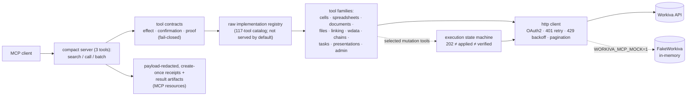

# regulated-reporting-mcp

[](https://github.com/dbett4/regulated-reporting-mcp/actions/workflows/ci.yml)

An MCP server for a regulated reporting platform (Workiva), built from operational patterns used on live government financial reports — with a guarded compact dispatcher, explicit proof states, and a credential-free mock mode you can run in under a minute.


```
$ pip install -e . && workiva-mcp-demo

=== 5. Attempt the write WITHOUT confirm_write (contract blocks it) ===
{"error": "Tool requires confirmation: workiva_write_verified",
 "requires_confirmation": true, "risk": "write", ...}

=== 6. Re-issue with confirm_write=true (verified write + readback) ===
{"status": "verified", "written_cells": 3, "mismatches": [],
 "state": "verified", "receipt_uri": "workiva-receipt://2026...-workiva-write-verified-..."}
```

## Why this exists

Financial statements filed by governments and public companies are produced on platforms like Workiva, and agents are increasingly asked to write into them. A wrong number in a statement workbook is not a UI glitch — it is a misstatement. So this server is built around one idea: **an accepted API call is not an applied change, and an applied change is not a verified one.** The default compact surface policy-gates every mutation and emits a redacted, write-once receipt. A tool may claim `readback` proof only when its result reports `verified` or `verification_failed`; otherwise the dispatcher returns `indeterminate` instead of inventing success.

## The three patterns this demonstrates

1. **OAuth2 client-credentials + token lifecycle** — stdlib-only auth with a module token cache, expiry-window refresh, and 401 clear-and-retry-once (`auth.py`, `http_client.py`).
2. **Async job polling and pagination at production scale** — 202 + `Operation-Location` polling (header and body variants), `@nextLink`/`next_url` pagination, parallel row-range cell fan-out, 429 backoff ladders with `Retry-After`, and binary-safe export handling that never UTF-8-mangles an xlsx/PDF body (`http_client.py`, `reapi/`).
3. **Policy-manifest confirm-before-write with typed proof** — every registered tool carries a reviewed contract (`effect` / `confirmation` / `proof`) validated at load; the compact dispatcher fail-closes on tools without contracts; mutations produce secret-redacted, write-once receipts; and `readback` contracts fail closed if a tool returns no verification outcome (`tool_contracts.py`, `compact_server.py`, `execution.py`, `receipt_store.py`).

## Architecture



Key design decisions:

- **A 202 without an operation location is `indeterminate`, never success on tools using the mutation state machine.** That state machine (`execution.py`) is injected with its request/poll functions, so it unit-tests with zero credentials. The proof map names this boundary rather than implying every raw implementation uses it.
- **The contract manifest is the runtime authority.** Name-based risk classification (leading-verb, not any-token) exists only as a drift diagnostic; dispatch refuses any tool without a reviewed contract, and `scripts/generate_tool_contract_manifest.py --check` keeps the manifest exactly covering the registered catalog.
- **A receipt is not readback.** `proof: receipt` means the dispatcher records the confirmed attempt and its reported state. `proof: readback` means the tool must return a deterministic verification result; missing proof becomes `indeterminate` with a receipt that says `pending_readback`.
- **The guarded surface is the default.** `workiva-mcp` and `python -m workiva_mcp` load the compact dispatcher. The raw catalog remains importable for dispatch internals and isolated development, but serving it requires an explicit unsafe opt-in because direct calls bypass the middleware.
- **The compact server keeps model context small.** Three tools front the full catalog (~97% fewer tools, ~90%+ fewer listing bytes, measured by `catalog_benchmark()`); large results are stored as MCP resources (`workiva-result://…`) instead of flooding chat.
- **`reapi/` is a pure-offline hardening layer** — typed 4xx/5xx error hierarchy, retry/poll policies, and a receipt validator with zero I/O and zero auth, grounded line-by-line in observed live API behavior.

## Quickstart (no credentials needed)

```bash
git clone https://github.com/dbett4/regulated-reporting-mcp
cd regulated-reporting-mcp
python -m venv .venv && source .venv/bin/activate
pip install -e ".[dev]"

workiva-mcp-demo        # end-to-end mock demo: list → read → gated write → verified readback
pytest                  # 126 credential-free tests
./scripts/proof.sh      # lint + manifest + tests + full offline demo
```

The demo runs against **FakeWorkiva**, an in-memory mock transport serving a synthetic "City of Riverton" ACFR-shaped workbook. It exercises the real code paths — contract gate refusal, one-shot 429 backoff, 202 + `Operation-Location` polling, readback verification, and the redacted receipt — entirely offline.

The demo's verified write stores its receipt under `~/.workiva_mcp/receipts/` (the same
write-once receipt store used against a real workspace). Set `WORKIVA_MCP_RECEIPT_DIR` to
redirect receipts to any other directory.

### Use it from Claude (mock mode)

```json
{
  "mcpServers": {
    "workiva": {
      "command": "workiva-mcp",
      "env": { "WORKIVA_MCP_MOCK": "1" }
    }
  }
}
```

### Against a real Workiva workspace

Provide OAuth2 client credentials (created in Workiva under an org API grant) and drop the mock flag:

```bash
export WORKIVA_CLIENT_ID=...
export WORKIVA_CLIENT_SECRET=...
export WORKIVA_REGION=us        # us | eu | apac
workiva-mcp                     # guarded 3-tool compact facade (default)
```

Credentials can also live in a `.env` file next to the package or pointed at with `WORKIVA_ENV_FILE`.

The raw 117-tool FastMCP surface is retained for isolated trusted-client development and for the compact dispatcher's internal registry discovery. It bypasses confirmation and receipt middleware, so it is never the default:

```bash
WORKIVA_MCP_CATALOG_MODE=full \
WORKIVA_MCP_ALLOW_UNGATED_FULL_CATALOG=1 \
workiva-mcp
```

Do not expose that mode to an autonomous or untrusted caller.

## Testing

`pytest` runs credential-free tests: transport behaviors are covered with injected/monkeypatched fakes, the offline `reapi` layer needs no I/O by design, and `tests/test_mock_mode.py` drives the real tool stack end-to-end through FakeWorkiva. Entrypoint tests prove compact is the default and the raw catalog fails closed without its explicit unsafe opt-in; contract tests prove a `readback` promise cannot silently degrade into `applied_unverified`, including formula cells and post-dispatch exceptions.

See the [claim-to-command proof map](docs/PROOF.md) and [threat model](SECURITY.md) for the exact guarantees and boundaries.

## Status

This is a Dave-authored, sanitized public implementation of transport, governance, and verification patterns used while delivering live government financial reports (annual comprehensive financial reports built and tied out on Workiva). It is not a copy of a client repository: engagement-management code is out of scope, and every workbook value, identifier, credential, and organization in this repository is synthetic.

## License

MIT — see [LICENSE](LICENSE).

---

Built by [Dave Bettner](https://davebettner.com).
