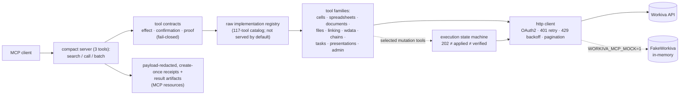

# regulated-reporting-mcp

[](https://github.com/dbett4/regulated-reporting-mcp/actions/workflows/ci.yml)

I built this MCP server around a problem I ran into while working on government
financial reports in Workiva: a successful API response does not necessarily
mean a change was applied, and an applied change has not necessarily been
checked. The server keeps those outcomes separate, requires confirmation before
writes, and records what happened without putting secrets or cell payloads in
the receipt.

You can run the full path without Workiva credentials. The included mock covers
the confirmation gate, rate-limit retry, asynchronous operation polling,
readback, and receipt creation in under a minute.


```
$ pip install -e . && workiva-mcp-demo

=== 5. Attempt the write WITHOUT confirm_write (contract blocks it) ===
{"error": "Tool requires confirmation: workiva_write_verified",
 "requires_confirmation": true, "risk": "write", ...}

=== 6. Re-issue with confirm_write=true (verified write + readback) ===
{"status": "verified", "written_cells": 3, "mismatches": [],
 "state": "verified", "receipt_uri": "workiva-receipt://2026...-workiva-write-verified-..."}
```

## The problem it solves

Financial statements are unforgiving. A wrong number in a statement workbook is
not a harmless UI bug. The default server therefore puts every mutation behind
a reviewed tool contract and writes a redacted, create-once receipt. A tool that
promises readback must report either `verified` or `verification_failed`. If it
cannot tell, the dispatcher returns `indeterminate`.

## What is implemented

1. **OAuth2 client credentials.** The standard-library implementation caches a
   token, refreshes it before expiry, and clears and retries once after a 401
   (`auth.py`, `http_client.py`).
2. **The less tidy parts of an enterprise API.** The client handles 202 polling
   through both header and body operation locations, `@nextLink` and `next_url`
   pagination, parallel row-range reads, 429 backoff with `Retry-After`, and
   binary-safe xlsx/PDF exports (`http_client.py`, `reapi/`).
3. **A write gate that is enforced in code.** All 117 registered tools have a
   reviewed `effect` / `confirmation` / `proof` contract. The compact dispatcher
   refuses tools with no contract, redacts mutation receipts, and treats missing
   readback as `indeterminate` (`tool_contracts.py`, `compact_server.py`,
   `execution.py`, `receipt_store.py`).

## Architecture



The choices that matter:

- For tools that use the mutation state machine, a 202 with no operation
  location is `indeterminate`, never success. `execution.py` accepts injected
  request and polling functions, so this behavior is testable without credentials.
  Not every raw tool uses that state machine; [the test map](docs/PROOF.md) says
  which claims apply where.
- The manifest, not a guess based on the tool name, controls dispatch.
  `scripts/generate_tool_contract_manifest.py --check` verifies exact coverage
  of the 117-tool registry. Name-based classification is only a drift warning.
- A receipt records an attempt and its reported outcome. It is not readback.
  `proof: readback` requires a deterministic verification result; otherwise the
  state is `indeterminate` and the receipt says `pending_readback`.
- `workiva-mcp` and `python -m workiva_mcp` start the guarded three-tool server.
  Serving the raw catalog requires an explicit unsafe opt-in because direct
  calls bypass confirmation and receipt handling.
- The three-tool front end reduces the listed tool count by about 97% and the
  listing payload by more than 90%, as measured by `catalog_benchmark()`. Large
  results become `workiva-result://…` MCP resources instead of chat payloads.
- `reapi/` is an offline-only layer for typed 4xx/5xx errors, retries, polling,
  and receipt validation. It performs no I/O and requires no authentication.

## Quickstart (no credentials needed)

```bash
git clone https://github.com/dbett4/regulated-reporting-mcp
cd regulated-reporting-mcp
python -m venv .venv && source .venv/bin/activate
pip install -e ".[dev]"

workiva-mcp-demo        # end-to-end mock demo: list → read → gated write → verified readback
pytest                  # 126 credential-free tests
./scripts/proof.sh      # lint + manifest + tests + full offline demo
```

The demo uses **FakeWorkiva**, an in-memory transport with a synthetic "City of
Riverton" ACFR-style workbook. It runs the same gate, one-shot 429 retry, 202
polling, readback, and receipt code used by the real transport.

The demo's verified write stores its receipt under `~/.workiva_mcp/receipts/` (the same
write-once receipt store used against a real workspace). Set `WORKIVA_MCP_RECEIPT_DIR` to
redirect receipts to any other directory.

### Use it from Claude (mock mode)

```json
{
  "mcpServers": {
    "workiva": {
      "command": "workiva-mcp",
      "env": { "WORKIVA_MCP_MOCK": "1" }
    }
  }
}
```

### Against a real Workiva workspace

Provide OAuth2 client credentials (created in Workiva under an org API grant) and drop the mock flag:

```bash
export WORKIVA_CLIENT_ID=...
export WORKIVA_CLIENT_SECRET=...
export WORKIVA_REGION=us        # us | eu | apac
workiva-mcp                     # guarded 3-tool compact facade (default)
```

Credentials can also live in a `.env` file next to the package or pointed at with `WORKIVA_ENV_FILE`.

The raw 117-tool FastMCP server remains available for isolated development and
for registry discovery inside the compact dispatcher. It bypasses confirmation
and receipt handling, so it is deliberately awkward to start:

```bash
WORKIVA_MCP_CATALOG_MODE=full \
WORKIVA_MCP_ALLOW_UNGATED_FULL_CATALOG=1 \
workiva-mcp
```

Do not expose that mode to an autonomous or untrusted caller.

## Tests

All 126 tests run without credentials. Transport tests use injected fakes;
`tests/test_mock_mode.py` drives the actual tool stack through FakeWorkiva.
Entrypoint tests check that compact mode is the default and that full-catalog
mode fails unless both unsafe flags are present. Contract tests cover formula
cells and exceptions after dispatch, and make sure a readback promise cannot be
reported as `applied_unverified`.

See [how to check each claim](docs/PROOF.md) and the [security notes](SECURITY.md).

## Status

This is my public, sanitized implementation of patterns I used while building
and tying out annual comprehensive financial reports in Workiva. It is not a
copy of a client repository. It contains no engagement-management code, and all
workbook values, identifiers, credentials, and organizations are synthetic.

## License

MIT — see [LICENSE](LICENSE).

---

Built by [Dave Bettner](https://davebettner.com).
